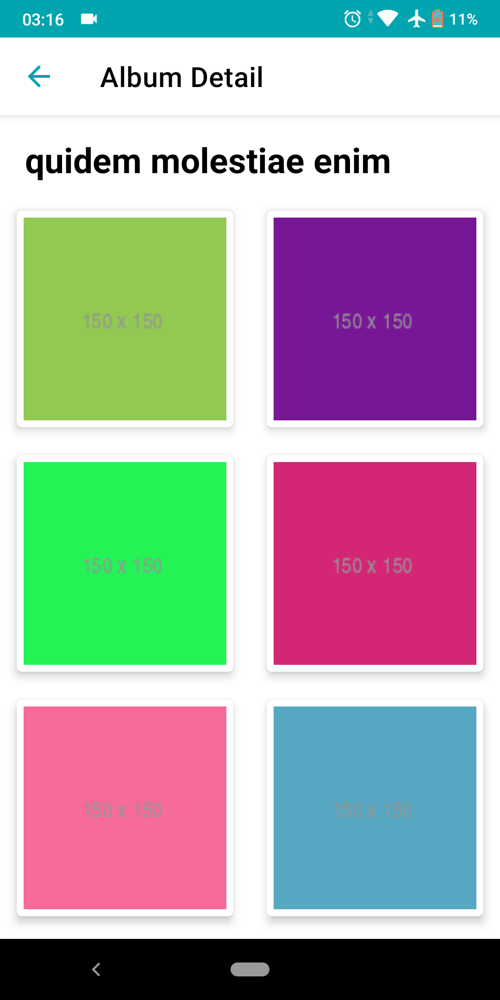
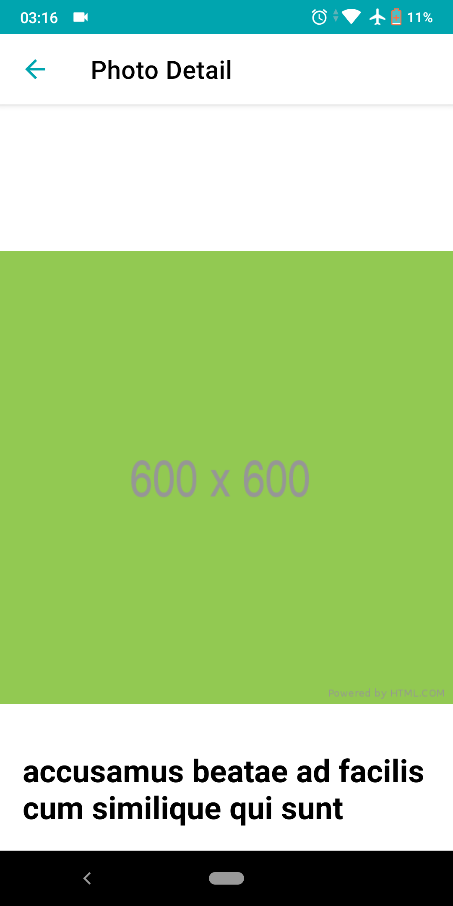

# kumparan-test
Kumparan Android Developer Technical Test<br>

## Video preview
[youtube](https://www.youtube.com/shorts/wW3HQaT6hvI)

## Feature
- See all posts
- See post detail and list comments inside post
- See user detail and list albums inside user detail
- see album detail and list photo inside album detail
- see photo detail and you can zoom in / out photo

## How to run locally ?
Clone project
```
git clone https://github.com/bakharaalief/kumparan-test.git
```
Open this project on your android studio. Wait the configuration and after that you can use this app.

## Project Structure
I use clean architecture for this app and divide the app into several folders
- [data](https://github.com/bakharaalief/kumparan-test/tree/main/app/src/main/java/com/bakharaalief/kumparantechnicaltest/data) - handle the data from API
- [domain](https://github.com/bakharaalief/kumparan-test/tree/main/app/src/main/java/com/bakharaalief/kumparantechnicaltest/domain) - handle business logic of this app
- [di](https://github.com/bakharaalief/kumparan-test/tree/main/app/src/main/java/com/bakharaalief/kumparantechnicaltest/di) -  handle dependency Injection
- [presentation](https://github.com/bakharaalief/kumparan-test/tree/main/app/src/main/java/com/bakharaalief/kumparantechnicaltest/presentation) - handle view
- [util](https://github.com/bakharaalief/kumparan-test/tree/main/app/src/main/java/com/bakharaalief/kumparantechnicaltest/util) - handle tools for mapping and testing data

## Dependencies
- [Retrofit](https://github.com/square/retrofit) - call API
- [Glide](https://github.com/bumptech/glide) - show and caching image from url
- [CircleImageView](https://github.com/hdodenhof/CircleImageView) - make image in circle shape
- [TouchImageView](https://github.com/MikeOrtiz/TouchImageView) - make image can zoom in or out
- [Mockito](https://github.com/mockito/mockito) - mock object for unit testing

## Screenshot






